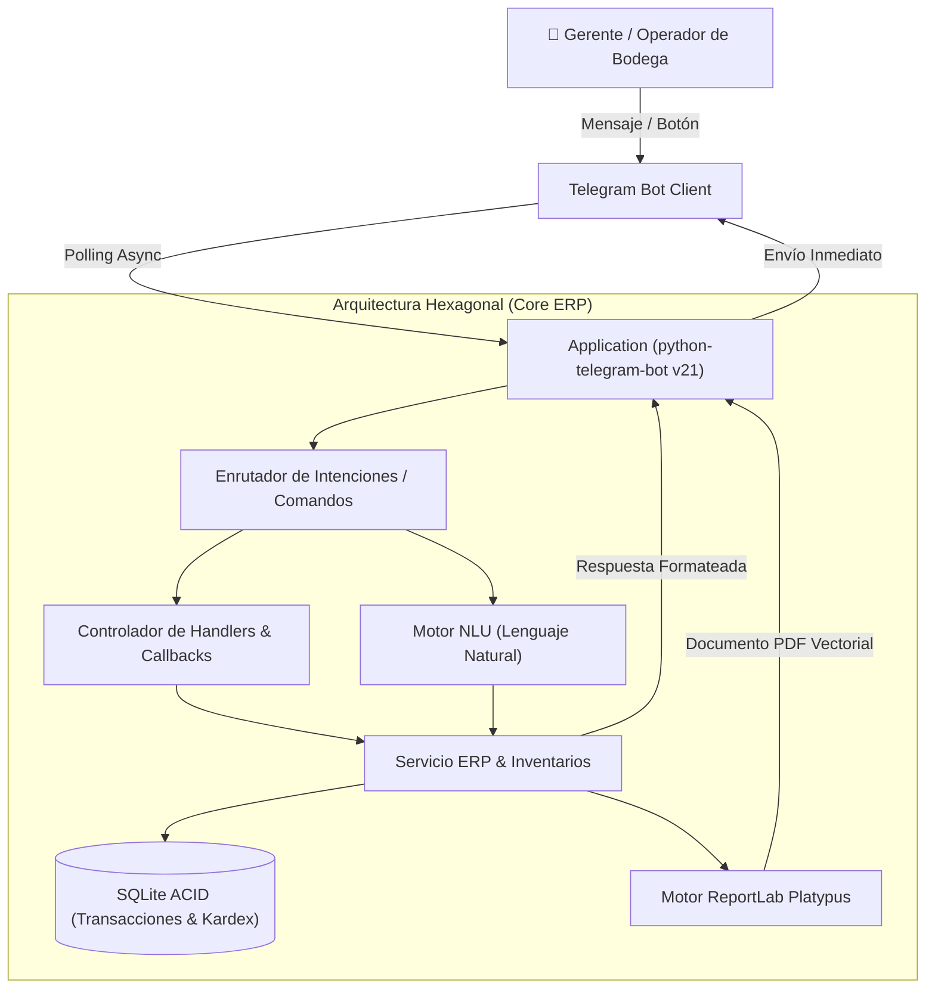

# 🏢 Telegram ERP Agent — Control de Inventario y Operaciones Empresariales

[](https://www.python.org/)
[](https://python-telegram-bot.org/)
[](https://docs.reportlab.com/)
[](https://www.sqlite.org/)
[](https://opensource.org/licenses/MIT)

---

**Autor y Titular:** Ingeniero Owen Badel Hooker  
**GitHub:** [OwenBadel](https://github.com/OwenBadel)  
**Repositorio Oficial:** [Telegram_ERP_Bot](https://github.com/OwenBadel/Telegram_ERP_Bot)  

---

## 📌 Visión General del Proyecto

**Telegram ERP Agent** es una solución corporativa de software que transforma a Telegram en un canal móvil transaccional y de consulta para la gestión de procesos empresariales y control integral de inventarios (**Kardex ERP**).

Permite a gerentes, auditores y operarios de bodega interactuar en tiempo real con la base de datos empresarial mediante botones interactivos de un toque (*Inline Keyboards*), comandos directos y un motor de procesamiento de lenguaje natural (*NLU*) capaz de interpretar peticiones libres sin requerir memorizar sintaxis complejas.



---

## 🌟 Características Principales

1. **Control de Inventario en Tiempo Real:**
   - Consulta instantánea de existencias por SKU o descripción.
   - Detalle de costo unitario, precio de venta, margen y ubicación física en estanterías.
   - Cálculo automático de la valoración total del almacén.

2. **Libro Kardex Transaccional con Auditoría:**
   - Registro atómico de **Entradas** (compras, recepción de proveedores), **Salidas** (ventas, despachos a clientes) y **Ajustes de Merma**.
   - Validación estricta que impide salidas superiores al stock físico disponible (protección contra stock negativo).
   - Trazabilidad con fecha, hora, documento de soporte (factura, orden, remisión) y usuario responsable.

3. **Alertas Proactivas de Quiebre de Stock:**
   - Monitoreo automático de umbrales mínimos (`stock_current <= stock_min`).
   - Sugerencias inmediatas de reabastecimiento indicando el déficit exacto para alcanzar el nivel óptimo.

4. **Motor NLU para Consultas en Lenguaje Natural:**
   - Interpreta peticiones conversacionales como:
     - `¿Cuánto stock queda de laptops?`
     - `Entrada 15 unidades de LAP-001 por factura F-902`
     - `Salida 2 de MON-001 orden V-401`
     - `Generar balance en pdf`
     - `Qué productos tienen bajo stock`

5. **Generador de Informes Ejecutivos en PDF:**
   - Motor programático con **ReportLab Platypus** en orientación horizontal (*Landscape*).
   - Tarjetas de KPIs (Total SKUs, unidades, valorización a costo y venta, alertas).
   - Tabla estilizada con paginación de dos pasadas (*NumberedCanvas*) y membrete corporativo con firma de ingeniería.

6. **Modo Dual (Telegram Live vs. Simulador CLI):**
   - **Modo Live:** Conexión nativa en tiempo real con la API de Telegram vía polling.
   - **Modo Simulador Interactivo:** Permite ejecutar, operar y auditar todas las funciones del ERP directamente desde la consola sin requerir token de bot previo.

---

## 📂 Estructura del Proyecto

```text
Telegram_ERP_Bot/
├── AGENTS.md                  <-- Directiva agéntica del proyecto
├── README.md                  <-- Documentación técnica y de usuario
├── INICIAR_APP.bat            <-- Lanzador de un clic para Windows
├── requirements.txt           <-- Dependencias de producción
├── .env.example               <-- Plantilla de variables de entorno
├── main.py                    <-- Punto de entrada dual (Live Polling / Simulador CLI)
├── test_erp_agent.py          <-- Suite de pruebas automatizadas TDD (100% Green)
├── core/
│   ├── __init__.py
│   ├── models.py              <-- Modelos de dominio Pydantic y Enums
│   ├── database.py            <-- Gestor SQLite con transacciones y seed inicial
│   ├── erp_service.py         <-- Lógica transaccional de inventario y Kardex
│   ├── nlu_engine.py          <-- Motor de intenciones en lenguaje natural
│   └── pdf_exporter.py        <-- Emisión de reportes ejecutivos en PDF (ReportLab)
├── bot/
│   ├── __init__.py
│   ├── keyboards.py           <-- Teclados en línea (Inline Keyboards)
│   └── handlers.py            <-- Controladores de comandos, mensajes y callbacks
├── data/                      <-- Base de datos persistente (erp_inventory.db)
└── reports/                   <-- Informes PDF generados
```

---

## 🚀 Guía de Instalación y Uso

### 1. Clonar el Repositorio
```bash
git clone https://github.com/OwenBadel/Telegram_ERP_Bot.git
cd Telegram_ERP_Bot
```

### 2. Crear Entorno e Instalar Dependencias
```bash
python -m venv venv
# En Windows:
.\venv\Scripts\activate
pip install -r requirements.txt
```

### 3. Configurar Variables de Entorno (`.env`)
Copia la plantilla `.env.example` a `.env`:
```bash
copy .env.example .env
```
Edita `.env` y coloca tu token de Telegram proporcionado por [@BotFather](https://t.me/BotFather):
```env
TELEGRAM_BOT_TOKEN=123456789:ABCdefGHIjklMNOpqrSTUvwxYZ
COMPANY_NAME=Industrias Badel & Asociados S.A.S.
```

### 4. Ejecutar el Agente

#### Opción A: Modo Telegram Live (Producción)
```bash
python main.py
```
Abre tu cliente de Telegram, busca tu bot y presiona **/start**.

#### Opción B: Modo Simulador Interactivo (Sin necesidad de Token)
```bash
python main.py --sim
```
Podrás interactuar directamente por consola ingresando comandos y textos como:
- `/start`
- `/stock LAP-001`
- `/entrada LAP-001 10 Factura-99`
- `/alertas`
- `/reporte`

---

## 🧪 Pruebas Automatizadas (TDD)
Ejecuta la suite completa de pruebas:
```bash
python test_erp_agent.py
```
Salida esperada:
```text
.......
----------------------------------------------------------------------
Ran 7 tests in 0.050s

OK
```

---

## 📜 Licencia
Proyecto desarrollado bajo la autoría y titularidad exclusiva del **Ingeniero Owen Badel Hooker**. Distribuido bajo la Licencia MIT.
